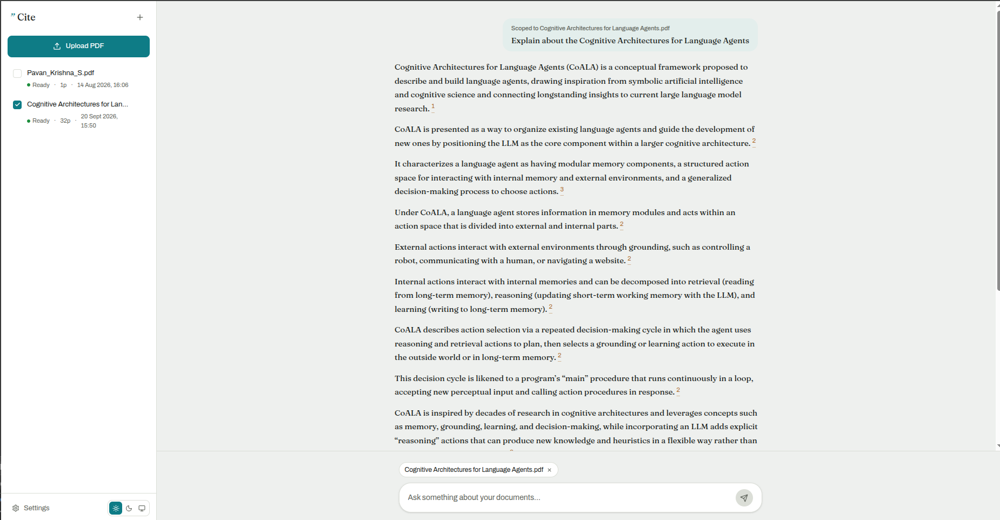
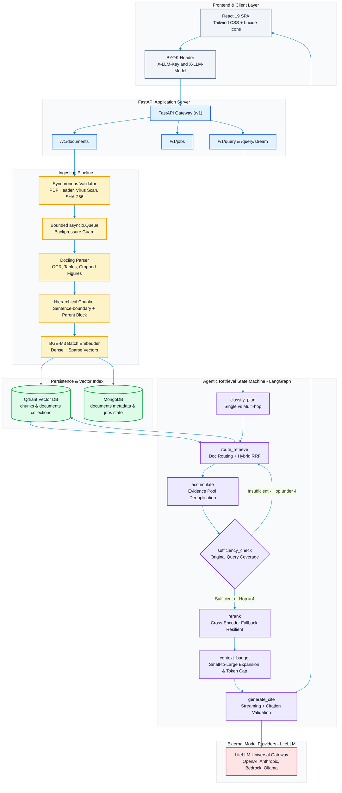
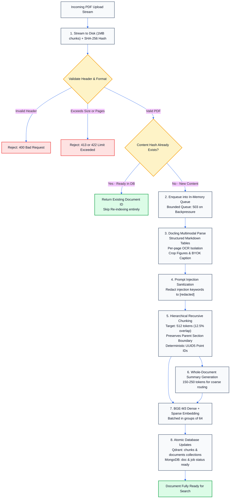
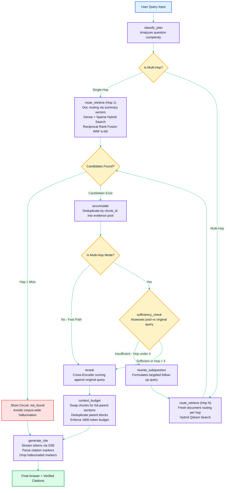
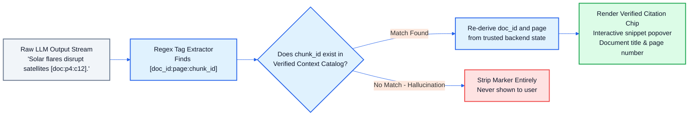

<p align="center">
  
</p>

<p align="center">
  <a href="https://www.python.org/downloads/"></a>
  <a href="https://fastapi.tiangolo.com/"></a>
  <a href="https://langchain-ai.github.io/langgraph/"></a>
  <a href="https://qdrant.tech/"></a>
  <a href="https://www.mongodb.com/"></a>
  <a href="https://github.com/DS4SD/docling"></a>
  <a href="https://react.dev/"></a>
  <a href="https://tailwindcss.com/"></a>
  <a href="#license"></a>
</p>

---

## 📌 Executive Overview

**Cite RAG** is an enterprise-grade Retrieval-Augmented Generation (RAG) platform designed to eliminate hallucinations and resolve multi-document queries with mathematical precision. Unlike naive RAG pipelines that simply embed queries and retrieve nearest chunks, **Cite RAG** implements an agentic multi-hop reasoning state machine, hierarchical small-to-large context resolution, hybrid dense/sparse vector search with Reciprocal Rank Fusion (RRF), cross-encoder reranking, and cryptographic-style citation validation.

Every factual assertion delivered to the user is grounded in exact source documents and verified against actual retrieved context before rendering. If a citation marker fails validation, it is stripped immediately—guaranteeing that users are never presented with fabricated references.

<p align="center">
  
</p>

---

## ⚡ What Makes Cite RAG Different?

| Capability | Naive RAG Systems | Cite RAG System |
|---|---|---|
| **Multi-Document Synthesis** | Fails on cross-document comparative or multi-step questions | **Agentic Multi-Hop Reasoning** decomposes queries, evaluates context sufficiency, and dynamically formulates sub-queries (up to 4 hops) |
| **Retrieval Strategy** | Dense-only semantic search prone to keyword misses | **Two-Stage Hybrid Search**: Dense + Sparse (BGE-M3) fused via RRF ($k=60$) followed by Cross-Encoder Reranker |
| **Contextual Precision** | Blind chunking produces chopped-off sentences or missing context | **Hierarchical Chunking**: Retrieves precise 512-token chunks, but expands them to complete parent sections for LLM synthesis |
| **Citation Integrity** | Blind trust in LLM citations; hallucinated page references | **Strict Citation Enforcement**: Re-derives and validates every sentence-level `[doc:page:chunk]` token; drops unbacked claims |
| **Key & Privacy Security** | Centralized API keys stored in server databases | **Zero-Retention BYOK**: `X-LLM-Key` is request-scoped, stored only in RAM during execution, and never written to disk or database |
| **PDF Understanding** | Flat text dump; destroys tables, figures, and structural layout | **IBM Docling Integration**: Extracts structured markdown tables, page-level OCR, and LLM-captioned figures |
| **Ingestion Resilience** | Process-crashing unhandled exceptions; duplicated points | **Deterministic UUID5 Point IDs**, SHA-256 content deduplication, and isolated per-page failure recovery |

---

## 🏛️ System Architecture

Cite RAG is architected as a unified, high-performance service. Ingestion and retrieval share common storage layers (Qdrant & MongoDB) while keeping background tasks isolated inside a bounded in-process worker pool.



---

## 🔄 Core Pipeline Workflows

### 1. Document Ingestion Flow

The ingestion pipeline handles raw PDF documents, streams them into temporary storage, performs cryptographic and structural validation, isolates per-page parsing issues, and generates dense/sparse index points idempotently.



---

### 2. Multi-Hop Retrieval State Machine

Built on **LangGraph**, the retrieval engine executes an adaptive graph. If a query is single-hop, it takes an ultra-low latency direct path. If it requires cross-document synthesis or comparative logic, the graph loops adaptively until sufficient evidence is gathered.



---

### 3. Citation Enforcement & Anti-Hallucination Guard

Unlike standard RAG systems that display whatever page number the LLM dreams up, Cite RAG enforces a strict verification boundary:



---

## 📂 Repository File Structure

```text
CITE-RAG/
├── app/                              # Core Python backend application
│   ├── main.py                       # FastAPI application entrypoint & lifespan
│   ├── config.py                     # Central Pydantic settings & environment configuration
│   ├── api/                          # REST API routers
│   │   ├── documents.py              # Upload, fetch, delete document endpoints
│   │   ├── jobs.py                   # Ingestion job status & tracking
│   │   └── query.py                  # Single query & SSE streaming endpoints
│   ├── ingestion/                    # 5-Stage ingestion pipeline
│   │   ├── parse.py                  # Docling multimodal parsing & figure extraction
│   │   ├── chunk.py                  # Hierarchical chunking & text sanitization
│   │   ├── embed.py                  # Dense + sparse BGE-M3 embedding batcher
│   │   ├── index.py                  # Deterministic Qdrant & MongoDB indexer
│   │   └── pipeline.py               # In-process worker queue & crash recovery
│   ├── retrieval/                    # LangGraph multi-hop reasoning engine
│   │   ├── graph.py                  # State machine definition & route compilation
│   │   ├── state.py                  # Typed RetrievalState definitions
│   │   ├── debug_trace.py            # Latency, hop, and prompt execution tracker
│   │   └── nodes/                    # Atomic state machine nodes
│   │       ├── classify_plan.py      # Query complexity classifier
│   │       ├── route_retrieve.py     # Document routing + hybrid RRF search
│   │       ├── accumulate.py         # Evidence pool merger & deduplicator
│   │       ├── sufficiency_check.py  # Iterative loop check & query rewriter
│   │       ├── rerank.py             # Cross-encoder reranking with fallback
│   │       ├── context_budget.py     # Small-to-large parent block expansion
│   │       └── generate_cite.py      # Citation generation & enforcement
│   ├── services/                     # Third-party & service client abstractions
│   │   ├── qdrant_client.py          # Qdrant client & RRF hybrid search implementation
│   │   ├── mongo_client.py           # MongoDB collections, documents & job queries
│   │   ├── llm_client.py             # LiteLLM client with zero-retention redaction
│   │   ├── docling_service.py        # IBM Docling wrapper with page error isolation
│   │   ├── embedding_service.py      # BGE-M3 HTTP client
│   │   ├── reranker_service.py       # Cross-Encoder HTTP client
│   │   └── virus_scan_service.py     # ClamAV daemon socket integration
│   ├── models/                       # Pydantic schemas & Mongo document entities
│   │   ├── schemas.py                # Request and response contract schemas
│   │   └── mongo_models.py           # DocumentMetadata & IngestionJob models
│   └── prompts/                      # Jinja2 prompt templates
│       ├── ingestion/                # Document summarization & figure captioning
│       ├── retrieval/                # Plan classification & sufficiency checks
│       └── generation/               # Grounded answer synthesis with citation format
├── frontend/                         # Modern React 19 + TypeScript web client
│   ├── src/
│   │   ├── App.tsx                   # Main layout container
│   │   ├── api/                      # Typed backend API client & SSE consumer
│   │   ├── components/               # UI components (ChatPanel, CitationChip, DebugPanel, etc.)
│   │   ├── hooks/                    # Custom hooks (useChat, useDocuments, useTheme, etc.)
│   │   └── styles/                   # Tailwind CSS stylesheets
│   ├── package.json                  # Frontend dependencies & scripts
│   └── vite.config.ts                # Vite build configuration
├── tests/                            # Automated test suite
│   ├── fixtures/                     # Test PDF documents
│   ├── mock_inference_server.py      # CPU-friendly mock embedding & reranker service
│   ├── integration/                  # End-to-end integration tests
│   └── services/                     # Service smoke tests
├── docs/                             # Documentation assets & deep-dive guides
│   ├── PIPELINES.md                  # Comprehensive technical ingestion & retrieval guide
│   ├── architecture.svg              # Scalable vector architecture diagram
│   ├── screenshot-light.png          # Light mode interface capture
│   └── screenshot-dark.png           # Dark mode interface capture
├── .env.example                      # Complete environment configuration template
├── .gitignore                        # Strict ignore rules for security & cleanliness
├── docker-compose.dev.yml            # Local development Qdrant vector database
└── requirements.txt                  # Python dependencies
```

---

## 🛠️ Tech Stack & Dependencies

```text
Backend:           Python 3.10+, FastAPI, Uvicorn, Pydantic v2
Orchestration:     LangGraph (State Machine Agent)
Vector Storage:    Qdrant v1.13.2 (Dense + Sparse Vectors)
Metadata Storage:  MongoDB v6.0+ (PyMongo / MongoMock)
Document Parser:   IBM Docling v2.15 (OCR, Tables, Figures)
Embedding/Rerank:  BGE-M3 (Dense 1024-dim + Sparse), BAAI Cross-Encoder
LLM Gateway:       LiteLLM (OpenAI, Claude, Bedrock, Ollama, DeepSeek)
Frontend:          React 19, TypeScript, Vite, Tailwind CSS, Lucide
Testing:           Pytest, Pytest-Asyncio, Pytest-Mock
Security:          Zero-Retention BYOK Architecture, Regex-based Injection Redaction
```

---

## 🚀 Quickstart & Setup Guide

### 1. Prerequisites

Ensure the following tools are installed on your machine:
- **Docker** & **Docker Compose**
- **Python 3.10+**
- **Node.js 18+** & **npm**

---

### 2. Clone the Repository & Configure Environment

```bash
# Clone the repository
git clone https://github.com/Pavan048/CITE-RAG.git
cd CITE-RAG

# Create your local .env from the documented template
cp .env.example .env
```

> [!TIP]
> Inspect [`.env.example`](file:///.env.example). All settings have sensible defaults for local development. In local sandbox mode with no GPU, the included CPU mock inference server can be used seamlessly.

---

### 3. Spin Up Infrastructure (Qdrant & MongoDB)

Start the Qdrant vector database using Docker Compose:

```bash
docker compose -f docker-compose.dev.yml up -d
```

> [!NOTE]
> If you do not have a local MongoDB instance running, you can spin one up via Docker:
> ```bash
> docker run -d -p 27017:27017 --name cite-mongo mongo:7
> ```

---

### 4. Setup Python Virtual Environment & Install Dependencies

```bash
# Create and activate virtual environment
python -m venv .venv

# On Linux/macOS:
source .venv/bin/activate
# On Windows (PowerShell):
.venv\Scripts\Activate.ps1

# Install backend dependencies
pip install --upgrade pip
pip install -r requirements.txt
```

---

### 5. Build the Frontend

```bash
cd frontend
npm install
npm run build
cd ..
```

---

### 6. Run the Application

Start the FastAPI application. It automatically hosts both the REST API and the compiled React frontend from `frontend/dist/`:

```bash
uvicorn app.main:app --host 0.0.0.0 --port 8000 --reload
```

Open your browser at **`http://localhost:8000`**.

---

### 7. (Optional) Run CPU Mock Inference Server for Testing

If running in an environment without GPU access for the self-hosted BGE-M3 model:

```bash
# Terminal 1: Mock Embedding Service
uvicorn tests.mock_inference_server:app --port 8001

# Terminal 2: Mock Reranker Service
uvicorn tests.mock_inference_server:app --port 8002
```

---

## 🔒 Bring-Your-Own-Key (BYOK) Security Model

Cite RAG is engineered around a zero-trust model for user API keys:

1. **Header-Scoped Execution**: The user's LLM API key is sent via the `X-LLM-Key` HTTP header (with `X-LLM-Model` selecting the provider, e.g. `openai/gpt-4o-mini`, `anthropic/claude-3-5-sonnet-20241022`).
2. **RAM-Only Lifetime**: The key resides solely in the memory context of the active request or background worker job.
3. **Zero Persistence Guarantee**:
   - `X-LLM-Key` is **never written** to MongoDB or Qdrant.
   - `X-LLM-Key` is **never written** to disk logs or temporary storage.
   - Error messages automatically redact any API key tokens to `[REDACTED]`.
4. **Crash Cleanliness**: If the server restarts mid-job, stranded jobs are deliberately failed with a clean explanation rather than resumed, ensuring keys are never cached across process boundaries.

---

## 📡 API Reference

### 1. Upload & Ingest Document

Upload a PDF document with your dynamic BYOK key:

```bash
curl -X POST "http://localhost:8000/v1/documents" \
  -H "X-LLM-Key: sk-your-llm-api-key" \
  -H "X-LLM-Model: openai/gpt-4o-mini" \
  -F "file=@sample_paper.pdf"
```

**Response:**
```json
{
  "doc_id": "9b1deb4d-3b7d-4bad-9bdd-2b0d7b3dcb6d",
  "filename": "sample_paper.pdf",
  "status": "queued",
  "job_id": "c7a82fb0-27a9-4560-b6aa-4568e21820cb"
}
```

---

### 2. Poll Ingestion Job Status

```bash
curl -X GET "http://localhost:8000/v1/jobs/c7a82fb0-27a9-4560-b6aa-4568e21820cb"
```

**Response:**
```json
{
  "job_id": "c7a82fb0-27a9-4560-b6aa-4568e21820cb",
  "doc_id": "9b1deb4d-3b7d-4bad-9bdd-2b0d7b3dcb6d",
  "status": "ready",
  "progress_pct": 100,
  "stage": "ready",
  "pages_total": 14,
  "pages_failed": [],
  "chunks_count": 38,
  "error": null
}
```

---

### 3. Query the Knowledge Base (SSE Streaming)

Query across all ingested documents or target specific `file_ids`:

```bash
curl -N -X POST "http://localhost:8000/v1/query/stream" \
  -H "Content-Type: application/json" \
  -H "X-LLM-Key: sk-your-llm-api-key" \
  -H "X-LLM-Model: openai/gpt-4o-mini" \
  -d '{
    "query": "Compare the evaluation results in Table 2 with the baseline in Section 4",
    "top_k": 10
  }'
```

**Streamed Events:**
- `event: text` &rarr; Plain answer tokens
- `event: debug` &rarr; Full debug trace with graph path, latency, and retrieved chunk metadata
- `event: done` &rarr; Final grounded answer payload with verified citations:

```json
{
  "answer": "The proposed architecture achieved a 14.2% higher context recall compared to the baseline [1].",
  "citations": [
    {
      "citation_id": 1,
      "doc_id": "9b1deb4d-3b7d-4bad-9bdd-2b0d7b3dcb6d",
      "filename": "sample_paper.pdf",
      "page_number": 6,
      "snippet": "Table 2: Comparative context recall across multi-hop benchmarks..."
    }
  ],
  "is_multi_hop": true,
  "hops_count": 2,
  "graph_path": ["classify_plan", "route_retrieve", "accumulate", "sufficiency_check", "route_retrieve", "accumulate", "sufficiency_check", "rerank", "context_budget"]
}
```

---

## 🧪 Running Automated Tests

Cite RAG includes an extensive test suite verifying end-to-end ingestion, multi-hop reasoning, graceful error degradation, and zero key leakage:

```bash
# Run the entire test suite
pytest tests/ -v

# Run zero-key-leakage verification tests
pytest tests/integration/test_llm_key_never_leaks.py -v

# Run multi-hop retrieval graph tests
pytest tests/integration/test_retrieval_multi_hop.py -v
```

---

## 🗺️ Roadmap & Planned Enhancements

- [x] Hierarchical small-to-large chunk expansion with parent-section preservation
- [x] Multi-hop iterative reasoning loop via LangGraph
- [x] Reciprocal Rank Fusion (RRF) with cross-encoder reranking
- [x] IBM Docling integration with page fault tolerance and image captioning
- [x] Zero-retention BYOK security layer
- [ ] Offline Ragas evaluation benchmark suite
- [ ] Distributed Celery/Redis worker fleet mode for enterprise clustering
- [ ] Direct export of synthesized reports with embedded PDF snippets

---

## 📄 License

This project is licensed under the **MIT License** — see the [LICENSE](LICENSE) file for details.
