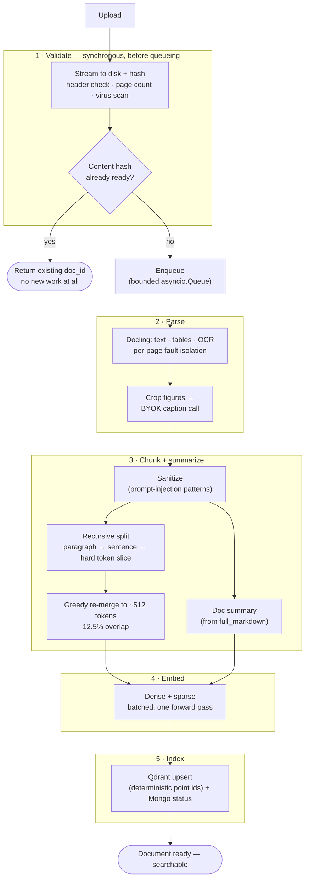
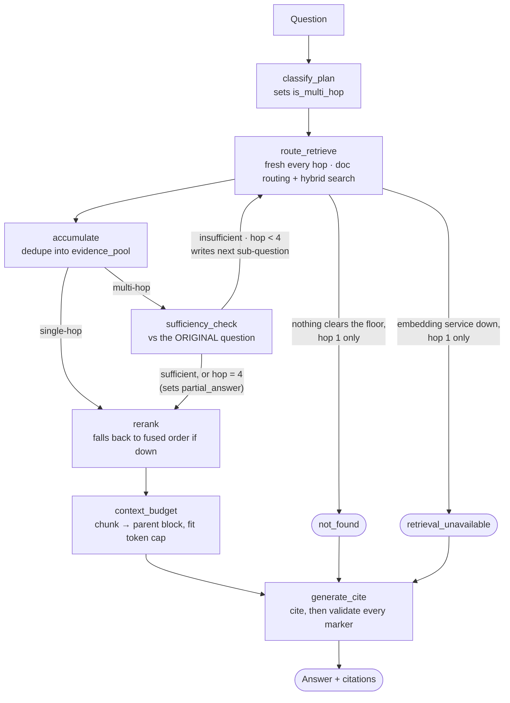

# Ingestion and retrieval, in depth

This is the detailed version — what each stage and each node actually does, how, and why it's
built that way. The README covers the shape of the system; this covers the mechanism.

---

## Ingestion pipeline

Five stages, run in order, each in its own module under `app/ingestion/`. Section numbers below
match the PRD's own numbering, since the code comments reference it the same way.



### Stage 1 — Validate

`app/api/documents.py`, `app/ingestion/parse.py`

The upload is streamed to disk in 1MB chunks as it arrives — never buffered whole in memory — with
a SHA-256 hash computed incrementally over the same stream. Once the upload finishes:

- The first 5 bytes must be `%PDF-`, or the upload is rejected outright.
- Page count is read via `pypdf.PdfReader`, which walks the xref/page-tree structure without
  decoding any page's content stream — a genuinely fast, header-only check, not a full parse.
- Size and page-count limits are read from config (`max_file_size_mb`, `max_page_count`), not
  hardcoded.
- If `virus_scan_enabled` is on, the file is streamed to a ClamAV daemon over a socket
  (`clamd.instream`) for scanning — off by default in this environment since there's no ClamAV
  daemon to talk to, but the code path is real, not a stub.

Only after all of that passes does content-hash dedup get checked, against
`find_ready_document_by_content_hash` in MongoDB. A match means this exact file already exists and
is `ready` — the temp upload is deleted, and the response returns the *existing* `doc_id` with a
job record that's already `ready` at 100%. No new Mongo document, no re-parsing, no re-embedding.
This is a deliberate design choice made explicit early on: an unchanged re-upload is the same
document, not a new one that happens to share content.

If it's genuinely new, a `doc_id` and `job_id` (both UUID4) are minted, `documents` and `jobs`
records are inserted with status `queued`, the temp file is moved to its final path named by
`doc_id`, and the job is handed to `enqueue_ingestion_job()`. That call does
`queue.put_nowait(job)` on a bounded `asyncio.Queue` — if the queue is full, it raises immediately
rather than blocking the request, and the API returns `503`. That's what "backpressure via queue
depth" means in code: push back on the caller, don't make them wait indefinitely, and don't spawn
unbounded threads to cope.

### Stage 2 — Parse

`app/services/docling_service.py`, `app/ingestion/parse.py`

This is where Docling does the actual document understanding. The converter is configured with
`do_ocr=True`, `do_table_structure=True`, and — importantly — `generate_picture_images=True`, which
is what makes `PictureItem.get_image()` return an actual cropped image later instead of `None`.

`convert()` is called with `raises_on_error=False`. This matters more than it looks: reading
Docling's own pipeline source (`base_pipeline.py`) shows it already isolates per-page failures
internally — a page whose backend fails to load gets marked invalid, and the overall result
degrades to `PARTIAL_SUCCESS` rather than the whole conversion raising. `docling_service.py` leans
on that instead of re-implementing per-page isolation by hand. `pages_failed` is built by checking
`page._backend is None or not page._backend.is_valid()` for each page in the result, converting
Docling's 0-indexed `page_no` to the 1-indexed page numbers used everywhere else in this system —
get that offset wrong and every citation and every failed-page report is off by one.

The parsed document is then walked item by item via `doc.iterate_items()`:

- A `SectionHeaderItem` isn't turned into its own chunk — a bare heading has nothing to retrieve on
  its own — but it updates a `current_section` variable that every following item inherits, and it
  marks a new parent-block boundary.
- A `TableItem` is exported with `.export_to_markdown(doc)` and tagged `content_type: table`.
- A `PictureItem`'s `.get_image(doc)` returns a PIL crop of just that figure. It's saved to PNG
  bytes in memory and sent to the user's own BYOK key via `llm_client.caption_image()`, using the
  `ingestion.figure_caption` prompt. The caption comes back as a chunk tagged
  `content_type: image_caption`.
- A `TextItem` is kept as `content_type: text`.

The full document is also exported to markdown once (`doc.export_to_markdown()`) and carried
forward — that's the source text Stage 3 summarizes from, so Stage 2 doesn't have to be re-run just
to get a document summary.

Docling is handed a file path, never raw bytes read into a Python object — it streams the pages
itself, which is what "never load a full PDF into memory" means in practice here.

### Stage 3 — Chunk + summarize

`app/ingestion/chunk.py`

The first thing that happens to every element's text here — before anything else — is
`sanitize_text()`: a set of compiled regexes matching instruction-hijacking patterns ("ignore all
previous instructions", "system:", "new instructions:", and similar), redacting any match to
`[redacted]`. This runs at exactly this boundary because it's the last point before the text can
ever reach a generation prompt — a hostile PDF's text should never get a chance to look like a
system instruction to the model.

Elements are grouped into sections: a contiguous run sharing the same `section_title` becomes one
group, and one group becomes one parent block with its own fresh UUID. If the same heading text
ever reappears later in a weird document, it starts a *new* parent block rather than merging into
the earlier one — sections are about contiguous position, not matching text.

Tables and image captions are already atomic — each becomes exactly one chunk, never merged into
the surrounding prose. Plain text elements go through actual recursive splitting:

1. `_split_oversized_unit()` — if a single paragraph is already small enough, it's left alone. If
   not, it's split at sentence boundaries. If a single *sentence* is still too long, it's hard-sliced
   by raw token count as a last resort. Paragraph first, sentence second, hard slice only if truly
   necessary — that's the "recursive" part.
2. `_greedy_windows()` — the resulting small units are merged back together up to the target token
   count (~512), carrying the trailing 12.5% of one window into the start of the next as overlap.

Each window is tagged with the page number of whichever unit it *starts* with, so a window that
happens to straddle a page break is cited to where it begins.

Chunk IDs are not random. They're `uuid5(NAMESPACE_URL, f"{doc_id}:{chunk_index}")` — deterministic,
derived from the document and the chunk's position. That one choice is what makes retries safe: if
this pipeline runs again for the same `doc_id` (say, retrying after a partial failure), it upserts
the exact same Qdrant points instead of creating a second, orphaned set of them. No separate
"have I already written this" check was needed — the IDs themselves make it idempotent.

The document summary is generated from up to the first 40,000 characters of the full markdown
(a 2000-page document's entire text can't go in one prompt) via the `ingestion.document_summary`
prompt, targeting roughly 150–250 tokens. Its embedding — not the raw document text — is what
document-level routing searches over at query time.

### Stage 4 — Embed

`app/ingestion/embed.py`

Chunk texts are batched (64 at a time by default) before being sent to the embedding service, so a
huge document doesn't produce one enormous HTTP request. Each call returns both a dense vector and
a sparse vector for every text in one round trip — that's BGE-M3's actual capability, one forward
pass producing both, which is also why there's no separate BM25 index anywhere in this system. The
document summary is embedded once, separately, since it's a single piece of text rather than a
batch.

### Stage 5 — Index

`app/ingestion/index.py`, `app/services/qdrant_client.py`

Chunk vectors and their metadata are upserted as one batch into `chunks_collection`. The
document-summary vector is upserted as a single point into `documents_collection`, using the
`doc_id` itself as the point ID.

Only once *both* of those writes succeed does the pipeline mark the Mongo `documents` record
`ready` and the `jobs` record `ready` at 100%. If something crashes between indexing and that final
update, the document is correctly left in `processing` — never marked ready, and therefore never
searchable, before it's actually safe to search. The local uploaded file is deleted on success and
left in place on failure, in case it's needed for debugging.

### When something goes wrong

Every exception raised anywhere in Stages 2 through 5 is caught by one handler in
`ingestion/pipeline.py`, which records `str(e)` — never the raw request, and never the BYOK key,
which `llm_client.py` has already stripped out of any LLM-originated error before it gets this far
— into the job's `error` field, tagged with whichever stage was in progress when it failed. Both
Mongo records are set to `failed`. One bad job can't take the worker pool down with it: the worker
loop itself catches the re-raised exception and moves on to the next job.

If the whole process restarts while a job is still `queued` or `processing`, that job cannot be
silently resumed — the BYOK key was never persisted anywhere, so there's no key left to finish it
with. `recover_stranded_jobs()` runs once at startup, before new workers start, and fails any such
job cleanly with an explicit "you'll need to re-upload" message, rather than leaving it stuck
forever with no explanation.

---

## Retrieval pipeline

Built as a `LangGraph` state machine (`app/retrieval/graph.py`), with one function per node under
`app/retrieval/nodes/` — each node reads and returns a typed `RetrievalState`
(`app/retrieval/state.py`), never a bare dict.



### classify_plan

Runs once, at the very start. A cheap LLM call decides whether the question is single-hop or
multi-hop — comparative language, multiple named entities, or a question that bundles two distinct
asks together are the signals it's told to look for. Single-hop is deliberately the common case and
skips every part of the loop machinery below.

### route_retrieve

The node that does the most work, and the one node the PRD is explicit about never splitting
apart: document routing and chunk retrieval happen together, and both re-run *fresh on every hop*.

If the caller pinned `file_ids`, routing is skipped outright and those IDs are used directly, on
every hop. Otherwise, the current sub-question is embedded and searched against
`documents_collection`; candidates below a similarity floor are dropped, and if nothing clears the
floor at all *on the first hop*, the query short-circuits straight to a `not_found` answer rather
than falling back to an unfiltered, corpus-wide search. On a later hop, a sub-question that finds no
documents just contributes nothing for that hop — the evidence already gathered from earlier hops
survives.

Once documents are resolved, chunk retrieval runs `Qdrant`'s hybrid search (dense and sparse,
against the resolved document set) and fuses the two ranked lists with Reciprocal Rank Fusion,
`k=60` by default:

```
score(chunk) = Σ  1 / (k + rank_in_list)     over every list the chunk appears in
```

The fusion is done in application code rather than `Qdrant`'s own server-side fusion query,
specifically so `k` stays a config value instead of a fixed internal constant.

This node writes only `latest_hop_candidates`, never `evidence_pool` directly — merging into the
accumulated pool is a separate concern, owned entirely by the next node.

If the embedding service itself is unreachable: on the first hop, there's no evidence at all to
fall back on, so the state is marked `retrieval_unavailable` and the query short-circuits to a
message that's explicitly *not* the same as "nothing relevant was found" — an outage and an empty
knowledge base are different failures, and conflating them would be actively misleading. On a later
hop, it's treated the same as a routing miss: that hop contributes nothing, the loop continues with
whatever it already has.

### accumulate

The only node allowed to write `evidence_pool`. It dedupes `latest_hop_candidates` against
whatever's already in the pool by `chunk_id`, and returns only the genuinely new items. This node
runs on every path, including single-hop — for a single hop, the merge is trivial (there's nothing
yet to dedupe against), which is why the diagram in the README draws the single-hop line skipping
straight past it; in the actual graph it still runs, just as a no-op.

### sufficiency_check

Only reached on the multi-hop path. An LLM call judges the *entire accumulated pool* against the
*original* question — never the sub-question that most recently ran — because by this point the
pool may hold evidence gathered for several different sub-questions, and what needs answering
hasn't changed.

This node also owns the hop-cap decision directly, rather than a separate router function: it
already has both the hop count and the verdict in hand. If the answer is "insufficient" and the
cap (4) hasn't been reached, a second LLM call writes the next sub-question, naming specifically
what's missing, and the graph loops back to `route_retrieve`. If the cap has been reached, the loop
stops and `partial_answer` is set — the second LLM call for a new sub-question is skipped
entirely in that case, since it would never be used.

### rerank

Runs once, after the loop ends, over the whole accumulated pool — not just the most recent hop.
Scored against the *original* question again, for the same reason `sufficiency_check` is: the pool
spans multiple sub-questions, but final relevance is about what was actually asked.

If the reranker service is unreachable, this doesn't fail the query. It falls back to sorting by
the fused RRF score computed back in `route_retrieve` — a worse ranking, not an outage, since
reranking is a quality refinement over a search that already produced a reasonable order.

### context_budget

Every surviving chunk is swapped for the full parent section it belongs to — the whole reason
parent blocks were stored alongside chunks in the first place. Multiple surviving chunks that
share a parent are deduped down to one block, so the same section text never appears twice purely
because several of its chunks scored well; that block instead carries a list of every chunk_id
that legitimately backs it, for citation purposes.

Blocks are added in reranked order until the next one would exceed the token budget, then trimming
stops — everything from that point on is by definition lower-ranked than what's already kept, so
there's no scenario where a smaller, worse block sneaks in after a better one was dropped. Nothing
is ever truncated mid-block; a block that doesn't fit is left out whole.

### generate_cite

The model is given the surviving context blocks and asked to write its answer with an inline
`[doc_id:page_number:chunk_id]` marker after each sentence. Only the `chunk_id` inside that marker
is ever trusted. After generation, every marker is checked against the known set of chunk_ids that
were actually in the supplied context; `doc_id` and `page_number` in the final output are always
re-derived from that trusted data, never taken from what the model typed, and a marker pointing at
a chunk_id that was never supplied is dropped outright — not corrected, not kept anyway.

If there's no context at all by this point — whichever short-circuit produced that — no LLM call
happens here either. There's nothing to hallucinate from, and no reason to spend a call confirming
what's already certain.

### Streaming

`POST /v1/query/stream` runs a second compiled graph that's identical except it stops at
`context_budget` — no `generate_cite` node at all. The final generation call happens outside the
graph, streamed directly through `llm_client.stream_text()`, which bridges a blocking provider
stream into an async generator via a background thread and an `asyncio.Queue`, so the event loop
is never blocked waiting on the network.

Citation markers are never resolved while text is still arriving — a marker can arrive from the
model split across several separate tokens, so there's no safe moment to trust a "complete-looking"
bracket mid-stream. The UI masks any bracket-shaped text the instant it appears and only resolves
real citations once the stream's final event carries the fully accumulated answer.

### The debug trace

Every response — streamed or not — carries a `graph_path`: the literal, ordered list of node names
that actually executed. It isn't reconstructed after the fact from state fields; it comes directly
from LangGraph's own `stream_mode=["updates", "values"]`, which is the actual record of what ran.
Alongside it: every hop's retrieved chunks, the final reranked set, and every single LLM call's
full prompt and response. None of this is part of the documented API contract — it's an
observability layer added on top of it.
